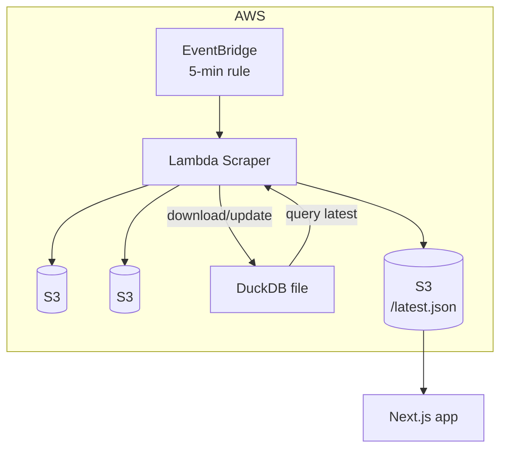

# System Architecture

## Data Flow
1. **Fetch** – Lambda grabs JSON from <EXTERNAL_API_ENDPOINT>.
2. **Persist raw** – raw response stored verbatim at `s3://<S3_BUCKET>/<RAW_PREFIX>/<timestamp>.json`
3. **Transform** – Python → pandas/pyarrow Table.
4. **Parquet** – write batch.parquet to <PROC_PREFIX>.
5. **DuckDB** – download mydata.duckdb, INSERT, CHECKPOINT, re‑upload.
6. **Serve latest** – SELECT … LIMIT 1 ➜ latest.json for frontend.

## Rationale
* DuckDB-on-S3 keeps SQL power without running a DB server.
* SAM gives the smallest infra template for Lambda‐centric stacks.
* EventBridge provides native scheduling; no external orchestrator required.